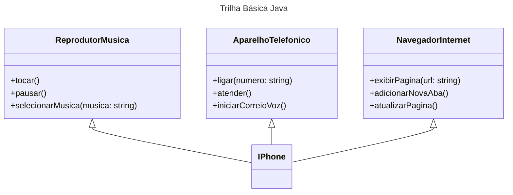

# Desafio Trilha Básica Java

## Diagrama UML

```mermaid
---
title: Trilha Básica Java
---

classDiagram
    ReprodutorMusica <|-- IPhone
    AparelhoTelefonico <|-- IPhone
    NavegadorInternet <|-- IPhone

    class ReprodutorMusica {
        +tocar()
        +pausar()
        +selecionarMusica(musica: string)
    }

    class AparelhoTelefonico {
        +ligar(numero: string)
        +atender()
        +iniciarCorreioVoz()
    }

    class NavegadorInternet {
        +exibirPagina(url: string)
        +adicionarNovaAba()
        +atualizarPagina()
    }

```